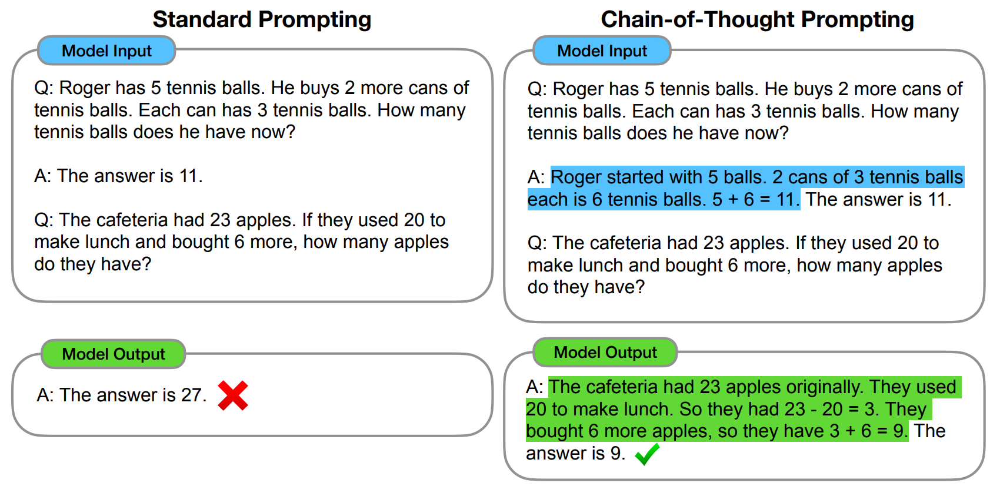

# Hybrid Embedding & Knowledge-Augmented Text-to-SQL Engine (HEKATE)

<!-- TOC -->d

- [Hybrid Embedding & Knowledge-Augmented Text-to-SQL Engine HEKATE](#hybrid-embedding--knowledge-augmented-text-to-sql-engine-hekate)
    - [Steps](#steps)
        - [Retrieval-Augmented Generation RAG](#retrieval-augmented-generation-rag)
        - [Chain of Thought CoT Prompting & Few-shot examples](#chain-of-thought-cot-prompting--few-shot-examples)
        - [Table hint: Filtering metadata](#table-hint-filtering-metadata)
        - [System Prompt Static Header + User Prompt](#system-prompt-static-header--user-prompt)
        - [Function Calling Safe and structured SQL generation](#function-calling-safe-and-structured-sql-generation)
        - [Run and Exception, Saving results](#run-and-exception-saving-results)
    - [Test results](#test-results)
    - [Things to do](#things-to-do)
    - [References](#references)

<!-- /TOC -->

* This project is to learn and implement general Large Language Model (LLM) framework with Text-to-SQL problem.
* This project focuses more on the application development and less on researching purpose.
* Related keywords
    - `Large-Language Model (LLM)`
    - `Retrieval-Augmented Generation (RAG)`
    - `Chain of Thought (CoT)`
    - `Langchain (with Conversation Buffer Memory)`

<center></center>

<br>

## Steps

### 1. Retrieval-Augmented Generation (RAG)

* For what?
    - LLM cannot remember domain-specified information (DB schema, column mapping, synonyms, etc. here).
    - Retrieve outer reference files and reflect those in final response.
* How to work?
    - Read JSON, CSV, XLSX files in `references` folder and convert to text.
    - Separate chunks of proper size with `CharacterTextSplitter` -> `Document` object
    - Vectorize each chunk with `OpenAIEmbedding`, Save into `FAISS`
    - Select highest k chunks (by similarity) for user question and provide it as `relevant_ref`
* Points
    - LLM Cannot memorize all of the schema.
    - Improve response quality by adding retrieved documents.


### 2. Chain of Thought (CoT) Prompting & Few-shot examples

* Role of CoT
    - CoT shows the order of thinking in LLM
    - We can simply trace where the model made a mistake.
* Few-shot example
    - We construct realistic natural prompt vs query examples and inject those in `STATIC_HEADER`
    - To clearly provide the model with (question, sql) patterns
* Points
    - CoT: Request "Show me your inference procedure" to LLM.
    - Few-shot example: pattern matching and rejection response (when invalid prompt is given) achieved.
* image: Figure 1 in ref [2]
    


### 3. Table hint: Filtering metadata

* For what?
    - Extract "possible table list" by analyzing related information in prompt.
    - Remove non-related table chunks in full schema -> Improvement of searching efficiency, accuracy
* Order
    - Call separate LLM with system prompt "Identify the most relevant table names..."
    - Segment first line of the response (including table names)
    - Reduce `FAISS` searching range with `metadata_filter={'table': [...]}`
* Points
    - Reduce "irrelevant chunks" in RAG step.
    - Optimize performance and response time in large scale schema.


### 4. System Prompt (Static Header) + User Prompt

* Static Header
    - CoT instruction, rejection condition, Few-shot examples, column mapping rule, etc. are injected as a system message at the first time.
    - Encourage the model to "always remember" without having to retransmit for every repeated conversation.
* User prompt
    - user prompt (`question`) and comments `-- Table Hint: ...` are only changed at each conversation.
    - `build_prompt(question, table_hint)` generates simply aggregated user message.
* Points
    - Token saving: Static header only once, user prompt short
    - However, the current implementation is repetitive and sends for each call, so the actual token savings are insufficient. (Future improvement)
* Instruction example
    ``` Text
    You are an expert SQL generator.
    Provide a chain-of-thought numbered reasoning before the SQL generation.
    If the user question is invalid or cannot be answered with SQL, response EXACTLY: Your question is invalid, Check your question again.
    Otherwise, after your reasoning, generate a VALID SQL query ONLY, wrapped in ```sql```
    When you are trying to answer, focus on searching appropriate "table name", "column name", etc. Especially "noun" information in prompt.

    **Do NOT generate queries that return entire tables (e.g., `SELECT * FROM ...` without WHERE/filter).**
    ```


### 5. Function Calling (Safe and structured SQL generation)

* Why do we use this?
    - Enforcing effect of "LLM must response with SQL fields" with JSON schema.
    - Reduce the risk of incorrect parsing
* How?
    - Register `{ name: "generate_sql", parameters: { sql: { type: "string" } } }` in OpenAI API `functions` parameter
    - Obtain query by parsing `.arguments` when the model returns sql as `function_call`.
* Point
    - Specify "I will receive SQL as a result of the function call" (not only "I will extract only SQL text")
    - Satefy and consistency ensured.


### 6. Run and Exception, Saving results

* Run
    - `DB.query(query)` -> Return pandas dataframe
* Exception
    - `df is None`: Cannot extract values by internal errors
    - `df.empty`: No matching records (with valid SQL)
    - `ProgrammingError`: SQL syntax error, server connection errors, etc.
* Saving results
    - Print extracted data frame in console
    - Saving CSV data per question in `results/session_{timestamp}`
    - Saving log file per session
* Point
    - Ensuring "reproducibility" for PoC: Log + CSV -> Easy to check and analyze execution results at any time

<br>

## Test results

<br>

## Things to do

* Self-Consistency
    - Like 'Montecarlo Dropout', increase the value of `temperature` and attempts to generate answers multiple times `n`, and the most frequently observed answer is selected.
    - Pros: accuracy, robustness improved.
    - cons: cost of inference increased. (possible if the cost is acceptable, or PoC step)
* Benchmark
    - Searching for llm, embedding model specialized in specific domain (such as financials, etc.)
    - Validation of cross-domain performance
    - Evaluation metrics
        - Execution Accuracy (EX) and Logical Form Accuracy (LF) in the `WikiSQL` dataset
        - Exact Match Accuracy (EM) in the `spider` dataset.
* Advanced parsing for reference data with system prompt
    - Explicit schema representation
* Reduction of response time

<br>

## References

1. Wei, Jason, et al. "Chain-of-thought prompting elicits reasoning in large language models." Advances in neural information processing systems 35 (2022): 24824-24837.
2. Kanburoğlu, Ali Buğra, and Faik Boray Tek. "Text-to-SQL: A methodical review of challenges and models." Turkish Journal of Electrical Engineering and Computer Sciences 32.3 (2024): 403-419.
3. Lewis, Patrick, et al. "Retrieval-augmented generation for knowledge-intensive nlp tasks." Advances in neural information processing systems 33 (2020): 9459-9474.
4. [Retrieval-Augmented Generation](https://medium.com/rate-labs/rag%EC%9D%98-%EC%A7%A7%EC%9D%80-%EC%97%AD%EC%82%AC-%ED%9B%91%EC%96%B4%EB%B3%B4%EA%B8%B0-%EC%B2%AB-%EB%85%BC%EB%AC%B8%EB%B6%80%ED%84%B0-%EC%B5%9C%EA%B7%BC-%EB%8F%99%ED%96%A5%EA%B9%8C%EC%A7%80-53c07b9b3bee)

---